## 实验报告

### 实验内容

1. 熟悉 go 命令行工具管理项目
2. 综合使用 go 的函数、数据结构与接口，编写一个简单命令行应用 agenda
3. 使用面向对象的思想设计程序，使得程序具有良好的结构命令，并能方便修改、扩展新的命令,不会影响其他命令的代码
4. 项目部署在 Github 上，合适多人协作，特别是代码归并
5. 支持日志（原则上不使用debug调试程序）

### 实验过程

#### 1. 安装cobra

* 使用命令 `go get -v github.com/spf13/cobra/cobra` 下载过程中，会出提示如下错误，这是因为墙的缘故，所以不能够直接在官网下载，所以使用了另外一种方法，直接在github上获取。

~~~
Fetching https://golang.org/x/sys/unix?go-get=1
https fetch failed: Get https://golang.org/x/sys/unix?go-get=1: dial tcp 216.239.37.1:443: i/o timeout
~~~

* 首先cd到 $GOPATH/src/golang.org/x目录下用 git clone 下载 sys 和 text 项目，其命令分别是

```
sys: git clone https://github.com/golang/sys
text: git clone https://github.com/golang/text
```

* 安装完上面两个依赖后，使用以下命令就可以安装cobra了，安装后在 `$GOBIN` 下出现了 cobra 可执行程序。

```
go install github.com/spf13/cobra/cobra
```

#### 2. 完成cobra小案例

创建一个处理命令 `agenda register -uTestUser `或 `agenda register --user=TestUser` 的小程序。

1. 在$GOPATH/src创建一个文件夹，文件夹名自定义。

~~~
cd $GOPATH/src 
mkdir Test
~~~

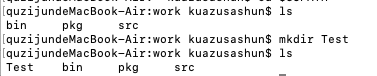

2. 进入该文件，并且使用以下的命令进行cobra初始化，其中Test为命令名字，初始化成功后，文件夹内会生成一个cmd文件夹，以及证书和`main.go`文件。

```
cobra init --pkg-name Test
```

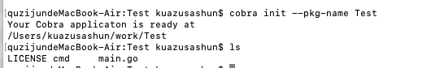

3. 初始化成功后，还需要添加命令，使用下面的命令进行命令的添加，`register`是命令的名字，添加完成后，在cmd文件夹内会生成一个`register.go`文件，在该文件内就可以对命令进行设置。

~~~
cobra add register
~~~

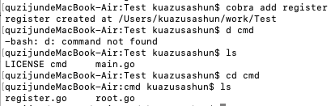

4. 修改 `register.go`, `init()` 添加

~~~
registerCmd.Flags().StringP("user", "u", "Anonymous", "Help message for username")
~~~

5. ` Run` 匿名回调函数中添加：

~~~
username, _ := cmd.Flags().GetString("user")
fmt.Println("register called by " + username)
~~~

6. 测试命令

~~~
go run main.go register --user=TestUser
register called by TestUser
~~~

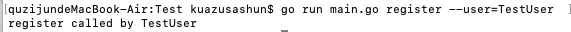

#### 3. JSON 序列化与反序列化

json 包是内置支持的，文档位置：https://go-zh.org/pkg/encoding/json/，下面给出json使用案例。

* 编码

1. 首先引入json的包文件。

~~~
import (
    "encoding/json"
    "fmt"
)
~~~

2. 然后定义一个结构体

~~~
type Message struct {
    Name string
    Body string
    Time int64
}
~~~

3. 定义结构体后就使用该结构体，实例化这个结构体。

~~~
m := Message{"Alice", "Hello", 1294706395881547000}
~~~

4. 实例化后使用json中的Marshal函数进行json编码。

~~~
b, err := json.Marshal(m)
~~~

5. 编码完成后可以打印该结果。

~~~
fmt.Print(b)
{"Name":"Alice","Body":"Hello","Time":1294706395881547000}
~~~

* 解码

1. 解码首先定义一个结构体变量

```
var m Message
```

2. 然后使用json中的Unmarshal函数进行json解码，并将上面定义的结构体变量作为参数传入，然后结构体变量对应的成员变量就赋上了对应的值了。

~~~
err := json.Unmarshal(b, &m)
~~~

#### 4. 命令设计

##### 用户注册

`agenda register -u username -p password - e email -t telphone`

用户输入该命令会进行注册操作，用户必须给出下面四个参数的值，否则就会创建不成功。注册成功后用户的信息将会保存到电脑中。

参数：

- --username/-u：用户名
- --password/-p：密码
- --email/-e：邮箱
- --telphone/-t：电话

代码：

~~~
func createUser(users []User, username string, password string, email string, telphone string) {
	if err := validate(users,username,password,email,telphone); err != nil{
		//check user info 
		fmt.Println(err)
		return
	} else {
		//add new user to list
		users = append(users,User{username,password,email,telphone})
		//sync the user info to file
		WriteUserToFile(users)
		fmt.Println("User register success")
	}
}
~~~

* 这里的注册需要使用validate函数来判断用户给出的注册信息是否正确，如果错误就返回错误信息，正确就将信息添加到内存中的变量，并且使用实体化进行持久化。

##### 用户登陆

`agenda login -u username -p password`

用户输入该命令会进行登陆操作，用户必须给出下面两个参数的值，然后程序会根据电脑存放的账号密码对进行匹配，匹配成功后将状态设置为已登陆对应的用户，不成功则返回错误信息。

参数：

- --username/-u：用户名
- --password/-p：密码

代码：

~~~
if isLogin() {
		fmt.Println("Please logout first!")
		return
	}
	//validate username and password
	if len(username) == 0 || len(password) == 0 {
		fmt.Println("Need a username and a password")
		return
	}

	for _,user := range users{
		if user.Username == username && user.Password == password{
			WriteCurUserToFile(user.Username)
			fmt.Println("Login success! Username is " + user.Username + "!")
			return
		}
	}
~~~

* 这里需要判断客户端是否已经登陆，这里通过后面的实体化实现，然后再从用户列表中判断是否有用户名、密码匹配的用户，有则设置为已经登陆状态。

##### 用户登出

`agenda logout`

用户输入该命令会进行登出操作，用户不需要给出参数，然后程序会根据电脑存放的临时文件判断登陆状态，如果已经登陆则转到登出状态并返回登出信息，如果没有登陆则返回错误信息。

关键代码：

~~~
fmt.Println("user logout")
	if isLogin() {
		//only can logout after login
		WriteCurUserToFile("logout")
		fmt.Println("Logout success!")
	} else {
		fmt.Println("Logout failed! Please login first!")
	}
~~~

* 用户登出用的是后面的实体化结果，将客户端的状态设置为登出状态，然后输出登出信息。

##### 帮助提示

agenda help [command]

如果给出命令参数就显示该命令的用法，不给参数就显示全部的命令。

~~~
if (len(args) == 1) {
			if args[0] == "register" {
				fmt.Println(registerStr)
			} else if args[0] == "login" {
				fmt.Println(loginStr)
			} else if args[0] == "logout" {
				fmt.Println(logoutStr)
			}
		} else {
			fmt.Println(registerStr)
			fmt.Println(loginStr)
			fmt.Println(logoutStr)
		}
~~~


####  5. 数据实体化

* 导入ioutil语言包用于io

~~~
import "io/ioutil"
~~~

* 用户信息读入

~~~
func ReadUserFromFile () ([]User, error){
	//read every users info
	var users []User	
	if data, err := ioutil.ReadFile(UserInfoPath); err == nil {
		str := string(data)
		json.Unmarshal([]byte(str), &users)
		return users, nil
	} else {
		return users, err
	}
}
~~~

这里使用ioutil中的ReadFile函数，直接将文件中所有的字节读入到data字节数组中，然后再分别转化为字符串以及对该字符串进行json解码。

* 用户信息写出

~~~
func WriteUserToFile (users []User){
	//write user info to file
	if data, err:=json.Marshal(users); err == nil {
		ioutil.WriteFile(UserInfoPath,[]byte(data),os.ModeAppend)
	} else {
		panic(err)
	}
	
}
~~~

这里使用的是ioutil中的WriteFile函数，首先将结构体json编码，然后将json化后的数组写入文件中。

* 登陆状态记录

~~~
func WriteCurUserToFile (curUser string) {
	//set the login status
	if err := ioutil.WriteFile(curUserPath,[]byte(curUser),os.ModeAppend); err != nil {
		panic(err)
	}
}

func ReadCurUserToFile() (string, error){
	//check the login status
	if data, err := ioutil.ReadFile(curUserPath); err == nil {
		return string(data), nil
	} else {
		return string(data), err
	}
}
~~~

另外用一个文件夹记录登陆状态，并给出两个函数用于改变登陆状态。

#### 6. 日志服务

* 日志服务的实现使用的是go语言中的log包

~~~~
import "log"
~~~~

* 首先定义用于将日志写到文件中的Logger，这里定义了两个分别用于错误日志，以及操作信息日志。

~~~
var (
	Error * log.Logger
	Login * log.Logger
)
~~~

* 然后获得日志文件的操作writter句柄，这里分别获得err以及log文件。

~~~
loginlog, err :=os.OpenFile(logpath,os.O_RDWR|os.O_CREATE|os.O_APPEND,0666)
	if err !=nil{
		log.Fatalln(err)
	}

	errlog, err := os.OpenFile(errpath,os.O_RDWR|os.O_CREATE|os.O_APPEND, 0666)
	if err != nil {
		log.Fatalln("file open error : %v", err)
	}
~~~

* 最后使用log包中的New函数创建Logger

~~~
Error = log.New(errlog, "ERROR: ", log.Ldate|log.Ltime|log.Lshortfile)
Login = log.New(loginlog, "LOG: ", log.Ldate|log.Ltime|log.Lshortfile)
~~~

* 使用时，与标准输出类似

~~~
Login.Println("login info")
Error.Println("error info")
~~~

### 程序测试

* 首先使用在程序文件夹中使用`go install agenda`命令安装，然后在$GOPATH/bin目录下就会生成一个agenda可执行文件，然后将该目录添加到path环境变量中，就可以直接使用agenda命令来执行。

* 创建用户

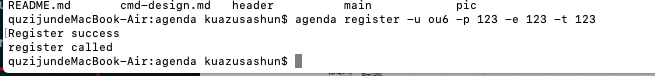

* 重复用户名错误提示

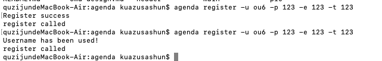

* 用户登陆

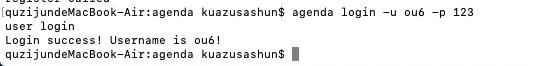

* 已登陆状态下登陆

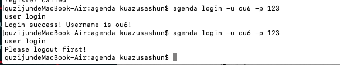

* 用户登出

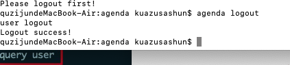

* 登出状态下再登出

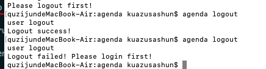

* 日志记录

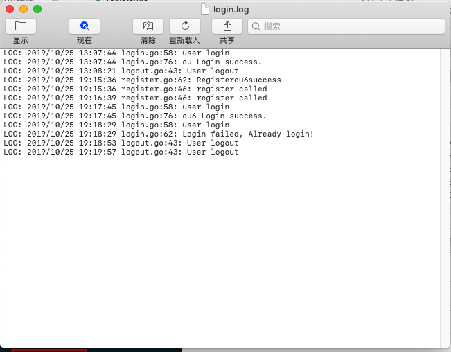

* 帮助提示

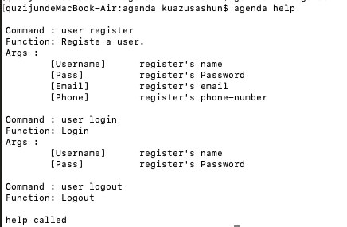

* go online


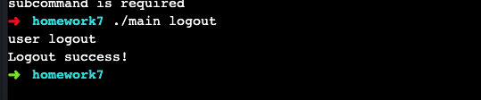