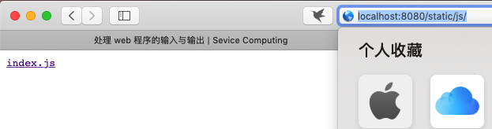
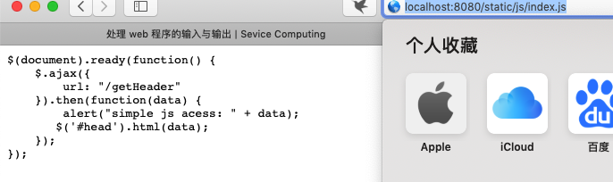
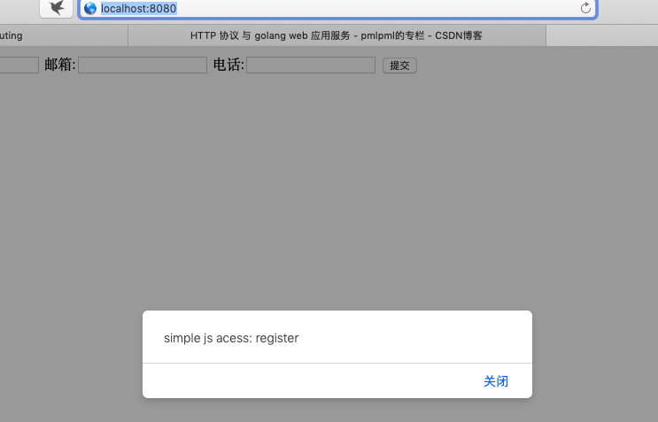
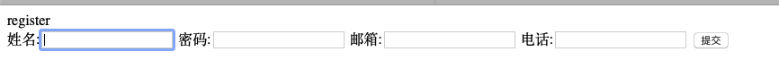
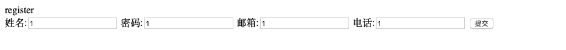

# 处理web程序的输入与输出
### 一、概述
设计一个 web 小应用，展示静态文件服务、js 请求支持、模板输出、表单处理、Filter 中间件设计等方面的能力。（不需要数据库支持）

### 二、任务
编程 web 应用程序 cloudgo-io。 请在项目 README.MD 给出完成任务的证据！

**基本要求**

1. 支持静态文件服务
2. 支持简单 js 访问
3. 提交表单，并输出一个表格
4. 对 `/unknown` 给出开发中的提示，返回码 `5xx`

### 三、实现基本功能

#### 1、支持静态文件服务
静态文件夹访问（显示文件夹文件列表）

静态文件访问（显示具体文件）

设置handle函数代码：

~~~
mx.PathPrefix("/static").Handler(http.StripPrefix("/static/",http.FileServer(http.Dir(webRoot+"/assets/"))))
~~~

当访问链接有/static前缀时进入静态文件访问模式。

#### 2、支持简单 js 访问

js文件

使用jquery的异步访问，访问cloudio服务器，并且返回表格的标题。

~~~
$(document).ready(function() {
    $.ajax({
        url: "/getHeader"
    }).then(function(data) {
    	alert("simple js acess: " + data);
       $('#head').html(data);
    });
});
~~~

go处理函数

使用http相应流返回表格标题。

~~~
func getHeader(w http.ResponseWriter, req *http.Request) {
	w.Write([]byte("register"))
}
~~~

调用js文件

更新表头

#### 3、提交表单，并输出一个表格

用localhost:8080访问后，进入一个表格页面，该表格会提交到`localhost:8080/register`中。

~~~
<form action="/register" method="post">
        姓名:<input type="text" name="username">
        密码:<input type="text" name="password">
        邮箱:<input type="text" name="mail">
        电话:<input type="text" name="phone">
        <input type="submit" value="提交">
    </form>
~~~

设置`localhost:8080/register`的post方法响应

~~~
mx.HandleFunc("/register", register).Methods("POST")
~~~

响应函数

先获得post的数据，然后调用模板创建一个带参数的html文件，然后调用Execute通过w返回该html文件。

~~~
func register(w http.ResponseWriter, req *http.Request) {
	req.ParseForm()
	username := req.Form["username"][0]
	password := req.Form["password"][0]
	mail := req.Form["mail"][0]
	phone := req.Form["phone"][0]

	page := template.Must(template.ParseFiles("assets/info.html"))

	page.Execute(w, map[string]string{
		"username":  username,
		"password":  password,
		"mail": mail,
		"phone": phone,
	})
}
~~~

Info.html

提交表格后，进入Info页面，显示刚刚提交的数据其中使用`{{.variable}}`来使用刚刚传入的参数。

~~~
<html>
  <head>
    <link rel="stylesheet" href="css/main.css"/>
    <title>Info</title>
  </head>
  <body>
    
    <table border="1">
      <tr>
        <td>用户名</td><td>邮箱</td><td>电话</td>
      </tr>
      <tr>
        <td>{{.username}}</td><td>{{.mail}}</td><td>{{.phone}}</td>
      </tr>
    </table>
  </body>
  </html>
~~~

填写表单

提交后显示表单

#### 4、对 /unknown 给出开发中的提示，返回码 5xx

设置处理函数

~~~
mx.HandleFunc("/unknown", unKnown).Methods("GET")
~~~

处理函数中调用http中的Error函数

~~~
func unKnown(reqw http.ResponseWriter, req *http.Request) {
	http.Error(reqw, "501 Unkown!", 501)
}
~~~

### 四、提高要求

#### 1、分析阅读gzip过滤器的源码
##### gzip简介
Gzip最初从Jean Loup Gailly和mark Adler创建，用于UNIX系统的文件压缩。我们经常使用带后缀的文件，Linux中的Gz，他们是gzip格式的。现在，他已经成为互联网上流行的文件压缩格式。
基于HTTP协议的Gzip编码是一种用于提高web应用程序性能的技术。流量大的网站经常使用gzip压缩技术来给用户感觉快。这通常是指安装在WWW服务器中的功能。当有人访问此服务器中的网站的时候，服务器中的此功能把压缩web内容并把便传输到访问的电脑浏览器以供显示。一般来说，纯文本的内容可以压缩到原始大小的40%。这样，传输会很快，效果是你单击URL，他会很快显示出来。当然，这也会增加服务器的负载，此功能模块安装在很多服务器中。