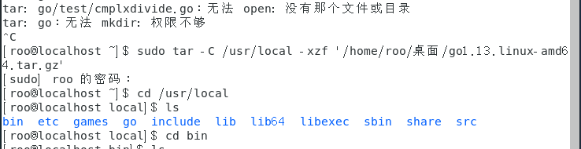

# 实验报告

- 1、实验目的
- 2、实验内容
- 3、实验过程以及结果
- 4、实验心得
- 5、代码在work文件夹，报告写在Readme.md

## 1、实验目的

1. 学习如何安装go语言以及配置其安装环境
2. 学习go语言的基本使用方法

## 2、实验内容

- 1、安装 VSCode 编辑器
- 2、安装 golang
- 3、安装必要的工具和插件
- 4、阅读官方文档如何使用Go编程
- 5、按文档学习如何写库以及测试文件

## 3、实验过程以及结果

#### 1、安装 VSCode 编辑器

* 在centos上安装vscode可以通过yum来安装，不过yum本身没有vscode的映像，需要导入映像才能安装，这里用下面的语句来导入映像

  ~~~
  sudo rpm --import https://packages.microsoft.com/keys/microsoft.asc
  sudo sh -c 'echo -e "[code]\nname=Visual Studio Code\nbaseurl=https://packages.microsoft.com/yumrepos/vscode\nenabled=1\ngpgcheck=1\ngpgkey=https://packages.microsoft.com/keys/microsoft.asc" > /etc/yum.repos.d/vscode.repo'
  ~~~

* 导入映像后就可以使用yum来安装了，与其他工具的安装方法相同

  ~~~
  yum check-update
  sudo yum install code
  ~~~

* 过程图片

  * 导入映像以及安装

  	安装成功

* 安装成功后在命令行输入code来打开vscode，或者也可以到系统的bin目录去创建vscode的桌面快捷键来打开。

#### 2、安装 golang

* 这里直接用yum显示没有go的映像，所以用另外一种方法来安装go语言包，首先在官网下载对应linux版本的go语言包，然后使用下面的tar命令将语言包解压到对应的位置上，这里需要管理员权限来解压才能解压到/usr/local上。

~~~
sudo tar -C /usr/local -xzf go1.13.linux-amd64.tar.gz
~~~

* 在解压完后，local目录下会多了一个名为go的目录，这样go语言的语言包就安装完成了，在go文件里面就有go的库文件以及运行文件。

* 安装完语言包在电脑上后，还是不能直接使用命令行来运行go语言，这里还需要我们去配置好命令行程序的环境变量，同时还要创建好我们写go语言的工作目录，这里根据要求创建为~/gowork。然后同时把go的安装目录路径与go的工作目录路径添加到bash的环境变量中。在centos中，其配置为: ~/.bashrc，在这上面添加一下两行就可以在命令行中运行go语言了。

~~~
mkdir $HOME/gowork
vim $HOME/.bashrc
export PATH=$PATH: /usr/local/go/bin
export GOPATH=$HOME/gowork
~~~

* 然后我们可以使用go env命令来检验go语言的配置是否配置好了，安装成功后在这里可以看到刚刚所设置好的GOPATH变量，以及go语言的安装目录，这样字go语言包就安装配置好了。

#### 3、安装必要的工具和插件

* go 语言的插件主要在 Github 上，安装 git 客户端是首要工作。

~~~
git install git
~~~

* 安装 go 的一些工具

1. 下载源码到本地

~~~
# 创建文件夹, -p表示按路径创建文件夹
mkdir -p $GOPATH/src/golang.org/x/
# 下载源码
go get -d github.com/golang/tools
# copy 
cp $GOPATH/src/github.com/golang/tools $GOPATH/src/golang.org/x/ -rf
~~~

2. 安装工具包

~~~
go install golang.org/x/tools/go/buildutil
~~~

然后进入vscode进行go语言的安装

3. 使用vscode进行编译运行，创建一个hello.go文件，并添加一下图片的代码，写完后在工具栏的Debug项选择run withoutdebug，然后在下面的控制台就可以看到我们想要看到的输出了。

#### 4、阅读官方文档如何使用Go编程

* 创建第一个程序

1. 首先创建好第一个程序的安装目录，并且进入该目录中创建一个go文件hello.go

~~~
mkdir -p $GOPATH/src/github.com/user/hello
cd $GOPATH/src/github.com/user/hello
touch hello.go
~~~

2. 打开hello.go文件并且输入以下的代码

~~~go
package main

import "fmt"

func main() {
	fmt.Printf("Hello, world.\n")
}
~~~

3. 使用go工具构建并安装此程序，同时在~/.bashrc文件上添加上工作目录中的bin文件夹，这样就可以直接用命令行来使用go工具构建的程序了

~~~
$go install github.com/user/hello
$hello
~~~

#### 5、按文档学习如何写库以及测试文件

* 创建第一个库

1. 记下来是自己创建一个库文件，然后用hello程序来使用它。第一步先创建好包的文件夹名字和路径，然后进入该创建的文件夹，并且创建一个名为reverse.go的文件。

~~~
mkdir $GOPATH/src/github.com/user/stringutil
cd $GOPATH/src/github.com/user/stringutil
touch reverse.go
~~~

2. 然后在新创建的reverse.go文件中添加以下的代码。

3. 使用go build 命令来测试该包的编译

~~~
go build github.com/user/stringutil
~~~

4. 修改原来的文件为以下的代码，并使用stringutil包。

5. 使用go工具安装hello文件，如果在该文件里就可以直接使用`go install `命令就可以安装了。安装成功后，我们可以直接在命令行中输入hello来运行该可执行文件，可以发现，引入的函数将输入的字符穿反转了，符合预期的结果。

~~~
$go install github.com/user/hello 或 go install
~~~

* 使用go的测试框架

1. 创建文件 `$GOPATH/src/github.com/user/stringutil/reverse_test.go`，并在该文件下添加以下的代码

2. 使用go test来运行该测试，结果显示测试通过。

~~~
$go test github.com/user/stringutil
~~~

3. 远程包的使用，`go` 工具可从远程代码库自动获取包使用以下go get命令来获取远程包，然后go会将包安装在工作目录的bin文件夹中，我们可以 在这个文件夹中找到远程安装的包。

~~~
$go get github.com/golang/example/hello
$GOPATH/bin/hello
~~~

## 4、实验心得

1. 大概的学习了一门新语言的基础，锻炼了自己对新语言的学习能力，同时懂得了我们可以对之前所学过的语言进行类比来学习新的语言，这样就可以更加容易的理解以及能够加深记忆。

2. 学会了在遇到问题时要学会去通过各种不同的途径来解决问题，这在以后的学习与工作中都尤其重要，所以我们要锻炼自己对面临的问题的 解决能力。

3. 了解代码规范在编写中的作用，其可以让代码更加的规范，让代码更加容易看得懂。

