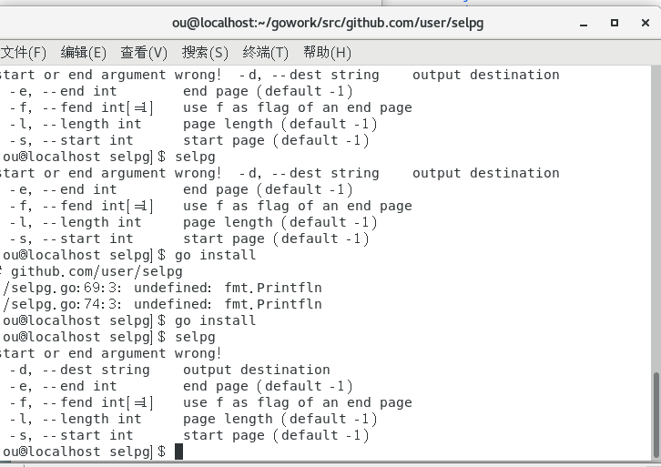
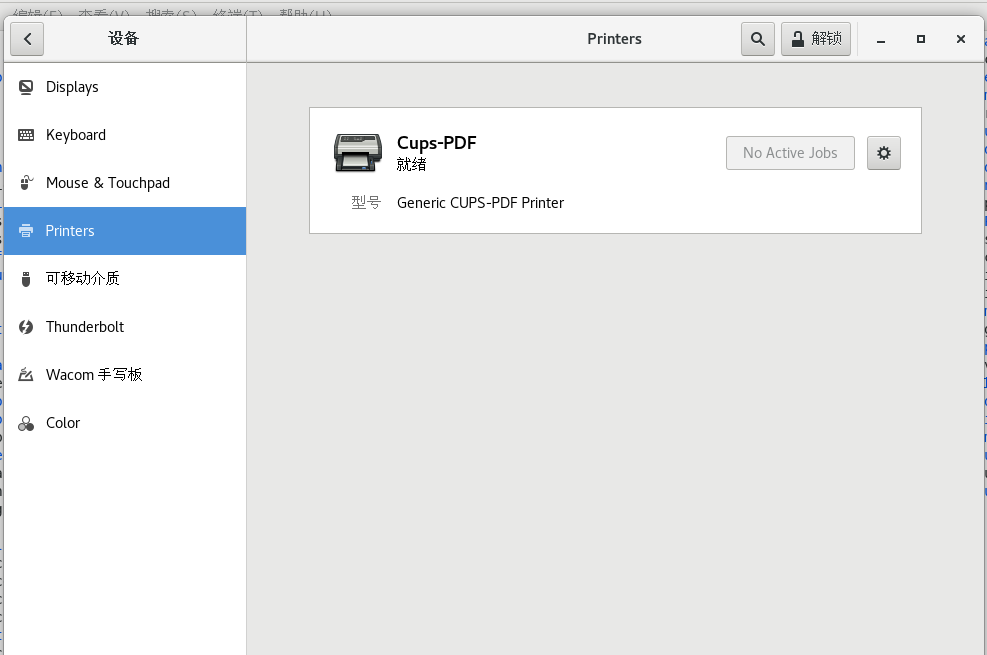
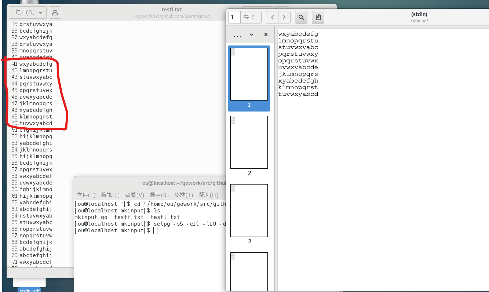
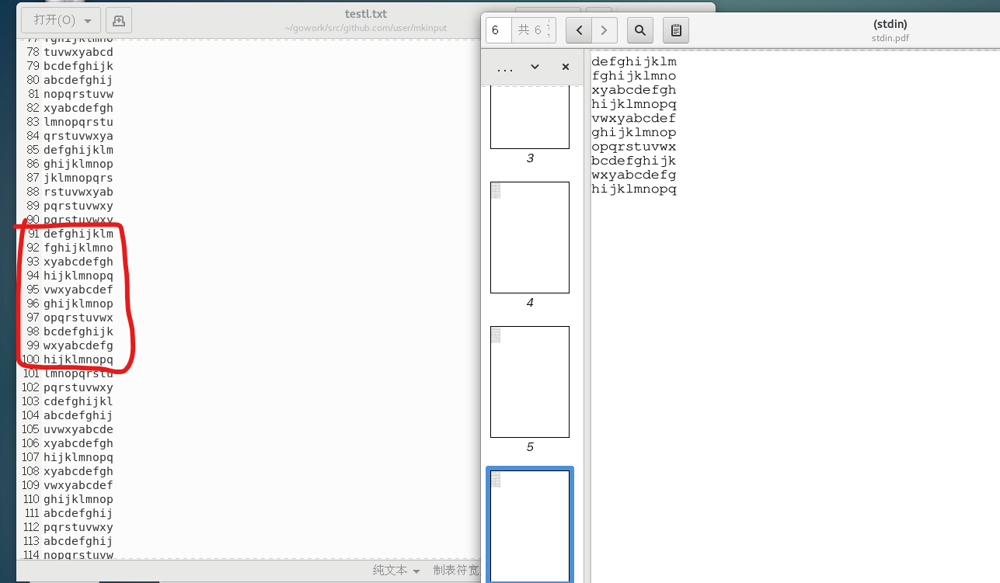
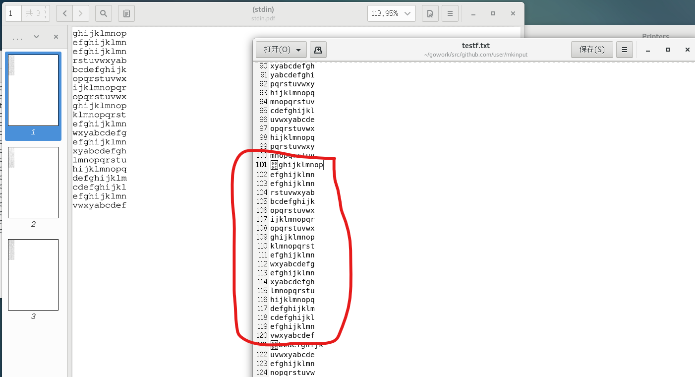
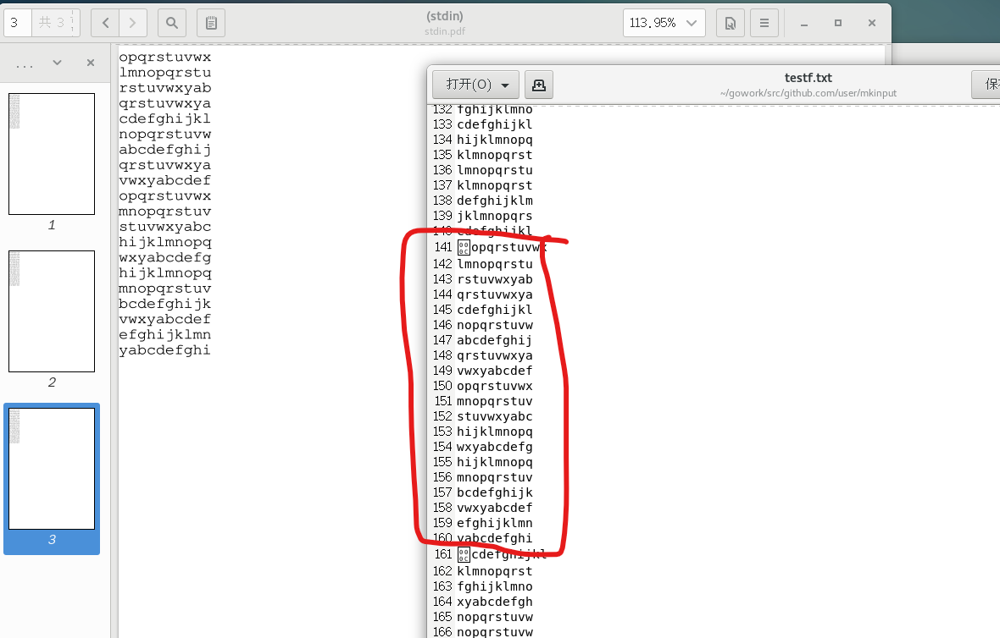
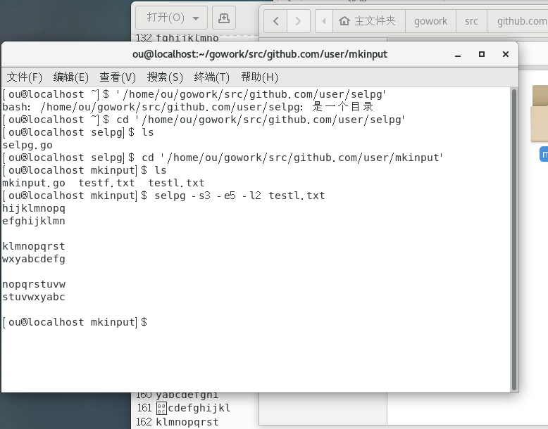
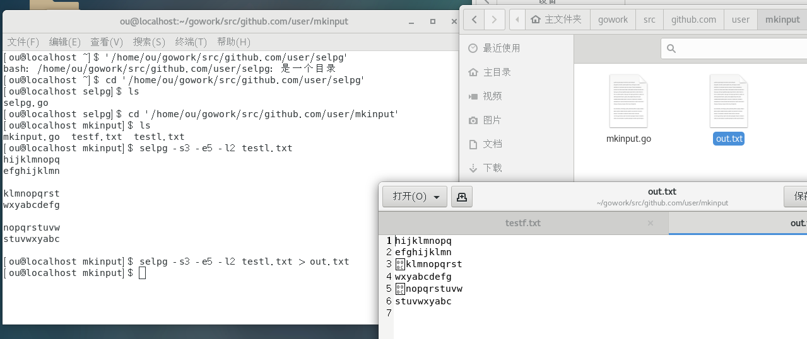

# 实验报告

- 1、实验目的
- 2、实验内容
- 3、实验过程
- 4、实验结果

## 1、实验目的

1. 学习命令行接口的一些概念与规范
2. 学习go语言的库使用方法
3. 开发 Linux 命令行实用程序。

## 2、实验内容

- 使用 golang 开发 [开发 Linux 命令行实用程序](https://www.ibm.com/developerworks/cn/linux/shell/clutil/index.html) 中的 **selpg**
  1. 请按文档 **使用 selpg** 章节要求测试你的程序
  2. 请使用 pflag 替代 goflag 以满足 Unix 命令行规范， 参考：[Golang之使用Flag和Pflag](https://o-my-chenjian.com/2017/09/20/Using-Flag-And-Pflag-With-Golang/)
  3. golang 文件读写、读环境变量，请自己查 os 包
  4. “-dXXX” 实现，请自己查 `os/exec` 库，例如案例 [Command](https://godoc.org/os/exec#example-Command)，管理子进程的标准输入和输出通常使用  `io.Pipe`，具体案例见 [Pipe](https://godoc.org/io#Pipe)

## 3、实验过程以及结果

#### 1. pflag库的使用与安装

* 根据要求，这次作业需要用到go语言中的pflag库。查阅官网的pflag库文档后，知道pflag库是原来的flag库的扩展，其对命令行的每一个参数标记添加了一个缩写，例如"--start 10"可以缩写为   "-s 10"。同时pflag库不是go语言自带的，需要在工作目录下，通过命令`go get github.com/spf13/pflag`，命令进行安装，安装后在工作目录下的`src/github.com`文件夹下会多了一个`spf13`文件夹，这个就是pflag库文件。
* 导入使用`import flag "github.com/spf13/pflag"`命令，同时使用一个别名方便后面的调用。

#### 2. 命令参数的声明

* 以下为参数的设置以及对应的代码



* ~~~go
  var start = flag.IntP("start", "s", -1, "start page")
  var end = flag.IntP("end", "e", -1, "end page")
  var length = flag.IntP("length", "l", -1, "page length")
  var f = flag.IntP("fend", "f", 0, "use f as flag of an end page")
  var dest = flag.StringP("dest", "d", "", "output destination")
  ~~~

* 这里根据要求需要用到五个参数，首先是两个必要参数`--start`、`--end`，用于表示需要输入文件的起始页和结束页。然后是`--length`参数，用于给出每页的长度。`--fend`参数用于决定是否用`\f`作为每一页的结束标记，最后是`--dest`参数，用于决定输出的位置。

#### 3. 命令参数的约束

1. **`--start`和`--end`参数**

* 这两个参数为必要参数，如果用户没有填写、或者填写的值小于等于零就会返回错误。这里的实现是将他们的初始函数设置为-1，并且在参数解析后判断start与end变量的值。如果当中一个值小于等于零，或者end小于start都会使得程序直接返回，并显示错误给用户。

~~~go
if *start > *end || *start < 0  || *end < 0 { //check the essential flag
		fmt.Println("start or end argument wrong!")
		flag.PrintDefaults()
		return
	}
~~~

2. **`-l（num）`和`-f`参数**

* 这两个参数是互斥参数，也就是用户只能选择其中的一个，如果都没有给出的话那么就为默认参数`-l 72`。其作用为决定文件的输入方式，如果是`-l (num)`参数就是以`num`行字符作为一页来输入，如果是`-f`参数就是输入的文件的页大小不定，每页以`\f`字符来结尾，其中`\f`字符是打印机分页的标识。

~~~go
flag.Lookup("fend").NoOptDefVal = "1"  //set flag if input a '-f' without arg
if *f == 1 && *length != -1 { //check using one method to input
		fmt.Println("flag -f and -l only can be used one!")
		flag.PrintDefaults()
		return
	}
	if *length == -1 { //set default to 72 length per page
		(*length) = 72	
	}

if *f == 1{
		// '\f' as end signal
		ret = runf(fname)
	} else {
		//static page length
		ret = runl(fname)
	}
~~~

* 在参数判断时，将length参数默认值设置为-1，这样就可以判断出来用户是否给出了`-l(num)`参数了，另外将`-f`的默认值设置为0，通过他们的默认值来判断用户输出是否符合互斥关系。判断后，如果length（页长）的值仍然为-1，再将length设置为72（因为用户有可能给出72的页长）。然后在根据用户给出的参数选择不同的输入函数。

3. **`-d`参数**

* -d参数用于决定输出的位置，例如目的打印机，这里用的是字符串，当没有给出参数时的默认值是空字符串，所以可以通过字符串的长度来判断用户是否有给出对应的`-d`参数。

* ~~~go
  if len(dslice) == 0 {
  	//no -d flag, output to stdin
  		fmt.Println(ret)
  	} else {
  	//set -d flag, use lp command with -d arg flag
  ~~~

#### 4. 程序实现

1. 固定页行数量的读取`-l(num)`

* ```go
  func runl(name string) string{
  //use '\f' as end of a page
  	file,_:= os.Open(name)
  	str := make([]byte, 0) //output slice
  	for i := 1; i <= *end; i ++{
  		data := make([]byte, 1)  
  		if i >= *start {
  			//among the target pages
  			for j := 1; j <= *length; j ++ {
                  //read n line
  				count,_ := file.Read(data)
  				for count == 1 && data[0] != '\n' {
  					str = append(str, data[0])  //add to the output
  					count,_ = file.Read(data)
  				}
  				str = append(str, '\n')
  			}
			if i != *end {
  				str = append(str, '\f')  //flag of an end print page
  			}
  		} else { //before the start page			
  			for j := 1; j <= *length; j ++ {
                  //read n line
  				count,_ := file.Read(data)
  				for count == 1 && data[0] != '\n' {
  					count,_ = file.Read(data) //skip the pre page
  				}
  			}			
  		}
  	}
  	return string(str)
  }
  ```
  
* 这里就是简单的读取，主要就是要根据`--start`参数跳到指定的地方再进行读取，最后返回读取到的字符串。

2. 以`\f`为页尾的读取`-f`

* ~~~go
  func runf(name string) string{
  //use '\f' as end of a page
  	file,_:= os.Open(name)
  	str := make([]byte, 0) //output slice
  	for i := 1; i <= *end; i ++{
  		data := make([]byte, 1)  
  		count,_ := file.Read(data)
  		if i >= *start {
  			//among the target pages
  			for count == 1 && data[0] != '\f' {
  				str = append(str, data[0])  //add to the output
  				count,_ = file.Read(data)
  			}
  			if i != *end {
  				str = append(str, '\f')  //flag of an end print page
  			}
  		} else { //before the start page
  			for count == 1 && data[0] != '\f' {
  				count,_ = file.Read(data) //skip the pre page
  			}			
  		}
  	}
  	return string(str)
  }
  ~~~

* 因为每页的大小都不定，所以不能直接使用seek函数来跳过指定的页数，需要逐个字符地读取，每读取到一个`\f`就是一页，到了`--start`参数指定的页数后就开始记录数据。

3.  输出到指定的位置`-dDestination`

* ~~~go
  //set -d flag, use lp command with -d arg flag
  		tem := "-d"
  		arg := []byte(tem)
  		arg = append(arg, dslice...)
  		cmd := exec.Command("lp", string(arg)) 
  		in,_  := cmd.StdinPipe()
  		go func() { //send the message just read to the subprocess bu pipe
  			defer in.Close()	
  			fmt.Fprint(in, ret)
  		}()
  		cmd.Run()
  ~~~

* `-d`参数作用主要是调用lp命令，并将用户给出的参数作为lp命令的参数，将标准输入（stdin）的数据传入到`-d`参数中的位置。这里需要用到的是管道以及exec模块，使用exec中的Command函数可以开启一个子进程来运行给出的命令，并传入对应的参数。然后通过`cmd.StdinPipe()`获取对应子进程的标准输入管道。再创建一个匿名线程函数，在这个线程中使用`fmt.Fprint(in, str)`函数将上面得到的字符串传入到子进程的管道中，这样就可以将读到的数据传到对应的位置中了。

## 4、实验结果

* 这里`-d`参数的检验用的是linux中的Cups-PDF，其和打印机的原理一样，安装后在打印机上会有Cups-PDF的选项，使用`lp -dCups-PDF`命令就可以调用该打印机。所以这里可以用于selpg命令的`-d`参数检验。



* 用代码生成了两个测试文件，分别用于按行读取(`testl.txt`)和按照`\f`符号读取(`testf.txt`)。

#### 按照行读取

* 命令： `selpg -s5 -e10 -l10 -dCups-PDF testl.txt`

* 开头



* 尾页



* 分析

  左边是testl.txt文件每行有10个字符，右边是打印文件。可以看到第5页在第41行，第十页在91行，总共生成10页，符合要求。

#### 按`\f`结尾读取

* 命令：`selpg -s6 -e8 -f -dCups-PDF testf.txt`

- 开头



- 尾页



- 分析

  右边为testf.txt文件每20行生成一个`\f`字符，左边是打印文件。可以看到第6页在101行，第8页在141行，总共3页符合条件。

#### 标准输出

* 

#### 输出成文件

