# 实验报告

* 1、实验目的
* 2、实验环境与要求
* 3、实验内容
* 4、实验过程以及结果
* 5、实验心得

## 1、实验目的

1. 初步了解虚拟化技术，理解云计算的相关概念
2. 理解系统工程师面临的困境
3. 理解自动化安装、管理（DevOps）在云应用中的重要性

## 2、实验环境与要求

- 用户通过互联网，使用微软远程桌面，远程访问你在PC机上创建的虚拟机
- 虚拟机操作系统 Centos，Ubuntu，或 你喜欢的 Linux 发行版，能使用 NAT 访问外网。

## 3、实验内容

* 1、安装 VirtualBox
* 2、创建Linux虚拟机；
* 3、配置Linux虚拟机网络；
* 4、配置用远程桌面访问你的虚拟机
* 5、安装Linux(centos)虚拟机图形界面Guest Additions

## 4、实验过程以及结果

####1. 安装VirtualBox

* 在Oracle 上下载Oracle VirtualBox 5.X版本

* 创建好创建虚拟机内部虚拟网络，使得 Vbox 内部虚拟机可以通过它，实现虚拟机之间、虚拟机与主机的通讯。通过管理 -> 主机网络管理器，可以创建一个虚拟网卡，网卡的名字设置为VirtualBox Host-Only Network #2，然后ip地址设置为192.168.199.1
####2. 创建Linux虚拟机

- 首先要下载好所要安装的Linux 系统的镜像文件，这里选用的是Centos操作系统，用的是Miniml ISO

- 镜像文件下载的同时，我们就可以使用VirtualBox来创建一个虚拟机了，根据提示用centos-base2作为名称创建虚拟机，这里可以看到VirtualBox在名称输入好后会自动选好系统的类型以及版本。
	- 因为是后面要安装桌面版的操作系统，所以这里选择了较为高的配置，选择了128M的显存，4096MB的系统内存，以及CPU数量为2。
- 然后就可以开始虚拟机的安装，在安装完虚拟机后，我们可以将虚拟机进行导出以避免以后还要进行复杂的安装过程，尤其是虚拟机出现难以修复的错误的时候。在导出后，以后创建centos系统的虚拟机就只需要简单的导入之前创建的ova文件就好了，在这个文件中配置以及系统都已经安装好了。

####3. 配置虚拟机网络

* 在配置好硬件的配置后，还要设置好虚拟机的网络配置。在虚拟机的设置中可以找到网络设置，这里需要使用两个网卡，其中第一个网卡已经默认设置好了NAT所以这里不需要修改。而第二个网卡是默认不用的，所以需要去启用第二个网卡，并将这个网卡根据要求设置为我们之前已经创建好的网卡。

  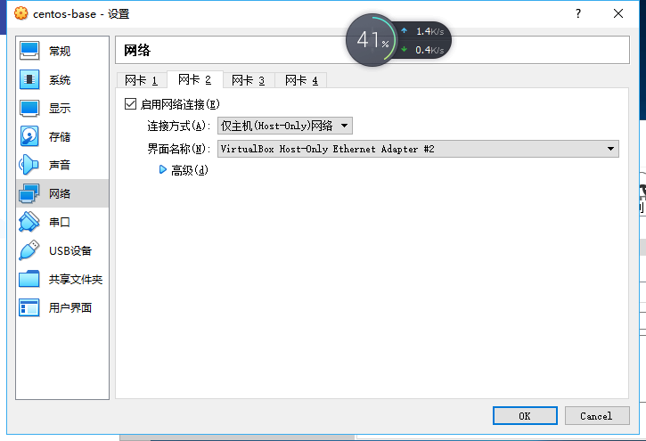

* 配置好网卡后，打开虚拟机，会进入到Linux的命令行模式，到这里可能还是连接不上网络。这时使用nmtui修改主机名以及第二块网卡的IP地址，同时将把autoactive选上，并在左边将虚拟机的网络连接上，这时就可以上网了，同时在主机命令行使用ping命令也可以连接到虚拟机了。

####4. 配置用远程桌面访问虚拟机

* 在配置好网络后，就已经可以进行远程桌面访问的配置了。远程桌面是通过VitualBox的扩展包来实现的，这里需要到Oracle官网去下载VirtualBox的扩展包。下载完成后，打开全局设置中的扩展选项，在这里将刚刚下载的扩展包添加上。

  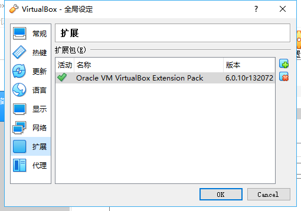

* 安装完扩展包就可以直接配置远程桌面了，打开虚拟机设置中的显示选项，在远程桌面中选择使用该服务器，并设置好服务器的端口。

  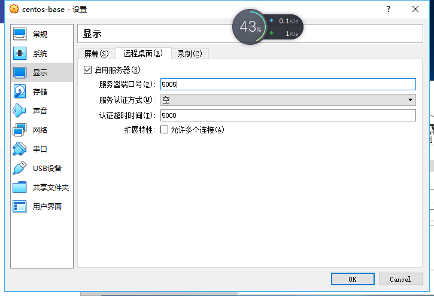

* 现在已经设置好虚拟机了，在打开虚拟机之后就可以进行远程登陆了。这里使用的window操作系统的Remote Desktop Cnnection Manager软件，这里首先添加一个主机“kk”，然后单击右键添加服务器，在添加的选项中设置好虚拟机服务器ip地址、端口以及账号密码，然后就可以连接了，连接后可以发现与远程桌面与虚拟机的界面一样。

* 登录的账号密码

  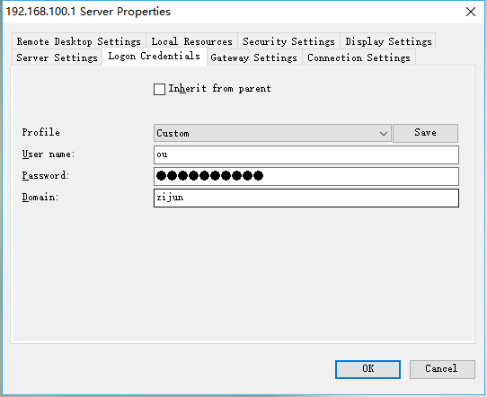

  用ip地址以及端口作为服务器名字

  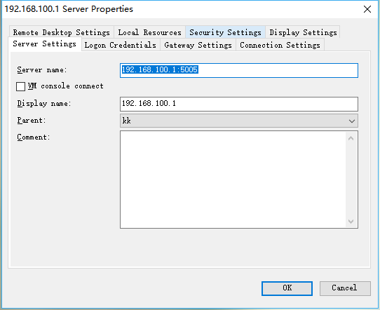

  安装好图形界面后的远程登录

  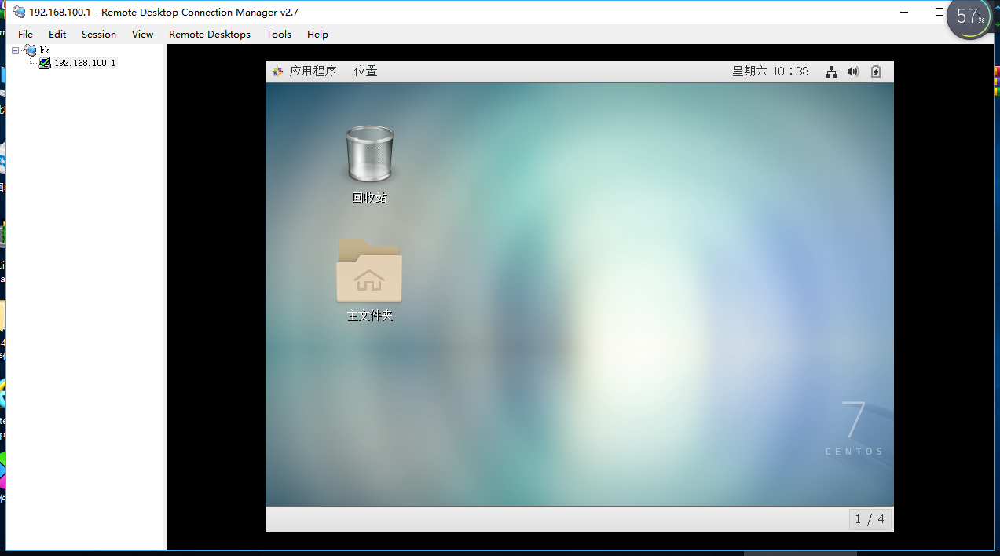

####5. 安装centos图形界面以及Guest Additions

* 配置好网络接着来进行图形界面的安装，首先安装好使用linux内置的yum命令来安装好wget，以及通过yum update命令来更新安装路径。

* 使用 yum groupinstall "GNOME Desktop" 命令来进行图形界面的安装，安装的过程比较慢，同时在第一次安装的时候可能因为安装包的损坏导致虚拟机不能开启，所以在此之前最好备份一下。

  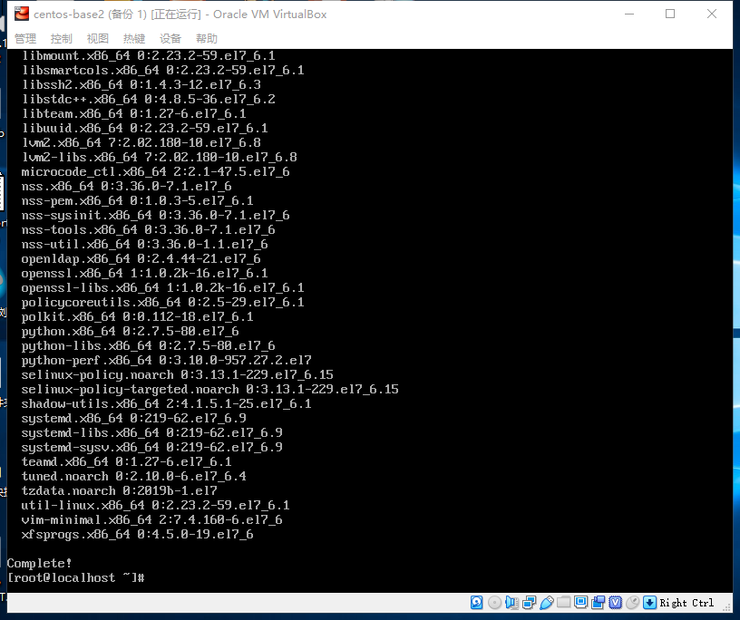

* 安装好后，电脑还是会处于命令行模式，这里用

  > ln -sf /lib/systemd/system/runlevel5.target /etc/systemd/system/default.target 

  命令将系统的默认模式设置为装好了的图形界面，重启后便多了一个选项，第一个选项点进去后就是centos的图形界面系统了，然后就可以进行图形界面系统的一些设置。

  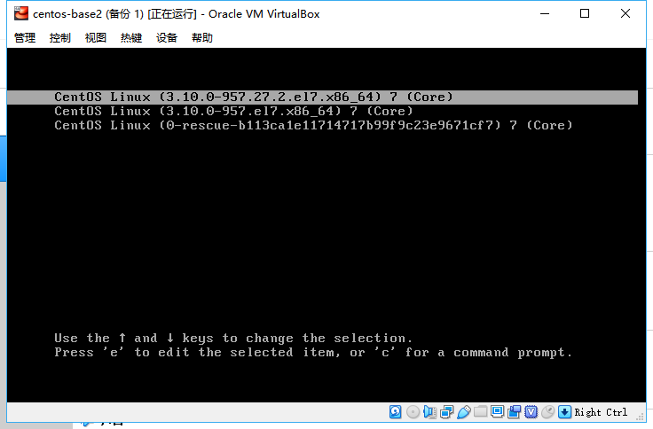

* 在装完图形界面后，为了方便，我们还需要安装VirtualBox的Guest Additions系统增强功能。这里如果直接点击虚拟机的设备->安装增强功能的话，会出现一个虚拟光盘的接入，同时系统会提示你去运行光盘的运行。但是在运行后会发生错误，在错误日志中可以发现找不到kernel-devel，需要用yum进行安装。

  安装kernel-devel

  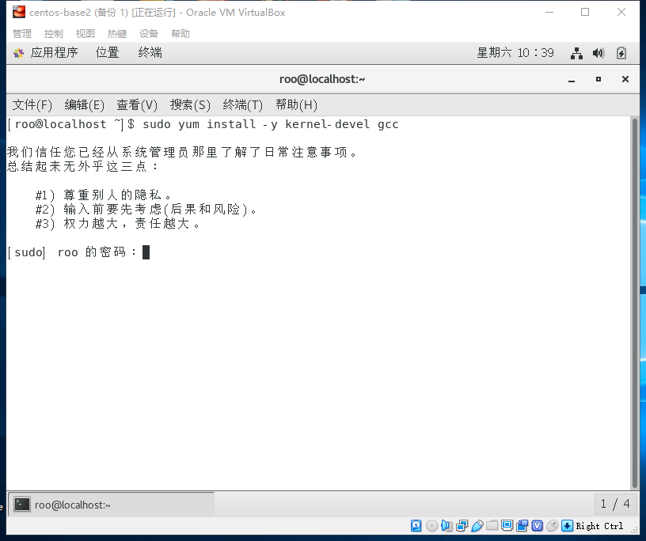

* 在安装后发现还是错误，找不到kernel-devel，可以推断是版本不匹配，于是在根据网上提示使用命令

  > sudo yum install -y "kernel-devel-uname-r == $(uname -r)"

  重新安装kernel-devel，然后再运行光盘安装，就没有生成错误了，Guest Additons的安装就完成了。

  Guest Additions安装成功

  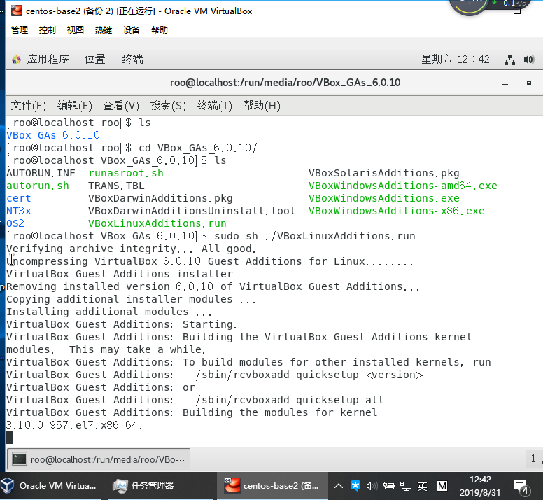

* 在增强功能安装完成后，就不用再按ctrl健来进行鼠标的切换了，同时远程桌面的清晰度分辨率也高了很多。

  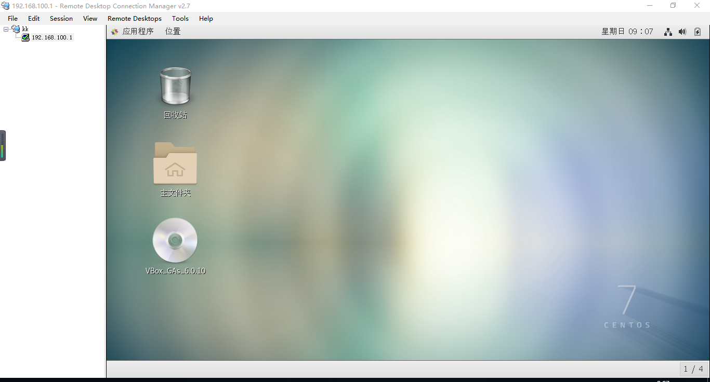

## 5、实验心得

​	1、系统的安装配置需要查阅大量的信息，要锻炼自己对手册的阅读能力。

​	2、安装时会有许多的错误出现，要锻炼自己处理安装时出现的问题的能力。

​	3、安装虚拟机系统时可以适当的多进行备份，因为安装时会经常出现各种各样的错误，备份后出现错误后就可以快速返回，而不用重新安装。